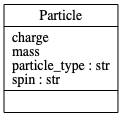

# Composition over Inheritance

Last week, we were introduced to the concept of "Composition Over Inheritance."
in object-oriented programming (OOP).

***Composition Over Inheritance:***  an OOP principle that states that classes should 
achieve [polymorphic](https://en.wikipedia.org/wiki/Polymorphism_(computer_science)) 
behavior and code reuse by their composition (by containing 
instances of other classes that implement the desired functionality) rather than 
inheritance from a base or parent class.

***Polymorphism:*** provision of a single interface to entities of different 
types or the use of a single symbol to represent multiple different types.

See, for example, the famous [Gang of Four (GoF) book, 
"Design Patterns"](https://en.wikipedia.org/wiki/Design_Patterns).

## Inheritance

Inheritance models an ***is a*** relationship. 

When you have a ***derived class*** (e.g. `Derived`) that inherits from a 
***base class*** (e.g., `Base`), you have a relationship where `Derived`
is a specialized version of `Base`.

## Composition
 
Composition models a ***has a*** relationship. 

Composition enables creation of complex types by combining 
objects of other types. 

A class Composite can contain an object of another class Component. 

This relationship means that `Composite` has one (1) `Component`.
 
*Note that if you want to experiment with or contribute to the code
in the F2/F2.2 folder, you will need to **open the F2.2 folder in its own
window in VSCode** (with F2.2 at the root of the workspace) in order
for the Pylance language server to resolve imports of module files in that
folder. By default, Pylance only searches the root folder for modules
to import. 
More info [here](https://github.com/microsoft/pylance-release/issues/236#issuecomment-673594586).*

# Modeling a system of particles

In the F2.2 folder, there is a series of tests 
(`test_particle_system_{a, b, c, d, e}.py`)
and associated Python modules (`particle_system_{a, b, c, d, e}.py`) that
illustrate various approaches to modeling a system of particles using
inheritance and composition.

## Test-Driven Development (TDD)

"If it's not tested, it's broken." - Bruce Eckel

As we develop our code, we will aspire to use TDD, 
which was first introduced in F3:

1. write a failing test
2. run the test, verifying that it fails and that your code lacks the
tested feature
3. write "just enough" code, the simplest possible, to make the test pass
4. refactor
5. retest
6. repeat steps 4-5 as necessary
7. repeat steps 1-6 as necessary 

As you see TDD in action and do it yourself, you will understand
what we mean by "we will aspire to use TDD."

### TDD for Requirements Development

Your test infrastructure inherently defines your code's requirements.

If we are using TDD, and we write the test that we want our code to pass,
then we've explicitly written a requirement for the code.

### Unit and integration tests: how many and what type?

The tests you write may be unit tests or integration tests depending
on your objective and design approach.

- unit test: tests that a small and isolated piece of the code, the 
so-called "unit," behaves as expected. The unit may be a function, 
object, or even a module-level constant
- integration test: tests the interaction of multiple units of
code and likely requires one or more of the following:
  - communication with a database or file system
  - special modifications of an environment
  - one or more other units to do something

Sometimes you will write and pass just one unit test at a time. 

Sometimes you may want to write and pass multiple unit tests when
implementing a complex feature.

## Units with Pint

Let's shift gears for a second and talk about a different kind
of unit--*a unit of measurement*.

The [pint](https://pint.readthedocs.io/en/stable/)
package looks like an interesting approach to incorporating 
physical quantities (product of a numerical value and a 
unit of measurement) into Python code. So, we take it for
a test drive in this seminar. All in all, it works pretty well.
It's very nice to let Python worry about units!

## particle_system_a.py

In the simple, brute force approach, we just define separate Classes
for each type of particle--one for an electron and one for a positron. 

This approach may not be the most scalable option, and may become
difficult to manage if we want to add systems of particles with physical
interactions.

## particle_system_b.py

Since elementary particles have similar or even identical properties, 
we could just use inheritance.

But which particles should inherit what from whom? Seems like this
could also become confusing and complicated very quickly.

Also, this doesn't seem quite right. Does the "is a" relationship
work here?

## particle_system_c.py

Maybe we want just one `Particle` Class with some logic in
the initializer to set the `particle_type`.

This approach is obviously much simpler from a Class hierarchy 
standpoint, but look at all of that duplicated code and complex
logic.

## particle_system_d.py

Now, perhaps we are making progress towards "composition over inheritance."

Even seems like a "quantum leap." :)

We are using the Abstract Base Class (ABC) for the `Particle` Class
with an initializer that consolidates all
of the code for initializing a particle type.

We've used composition correctly, since each `Particle`
"has a" `Property` object that 
does one thing and does it well...sets the properties of a particle.

(We've also gotten rid of the ugly logic tree and opted for
using a dictionary for storing properties of each particle type.)

## particle_system_e.py

When we implement a system of particles with some physics,
we see that perhaps we have a good object-oriented design to build upon. 

We easily added a `position` instance attribute to our `Particle` 
Class and added the `System` Class to model a collection of particles.

For now, we put the `potential_energy` method in the 
`System` Class. Perhaps
in the future, we would use the `@abstractmethod` decorator to define a
generic interface for the physics of systems of particles.

In our test, we use `System.potential_energy()` to compute
the energy of three protons spaced 1 nm apart in an equilateral
triangle.

