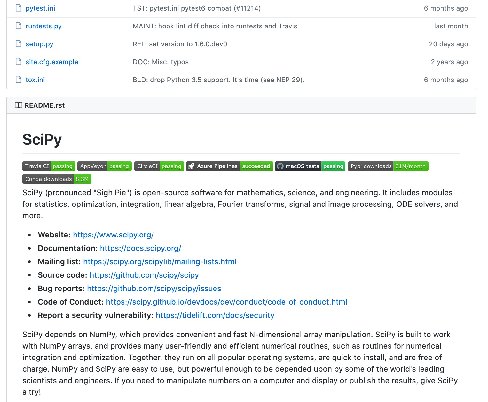

turboPy Internship Kick-off
===========================

Performing Research
===================
- Starts with an idea, but that's the easy part. Then you must...
- Sell
- Plan
- Program (not coding...scope + resources)
- Budget
- Execute
  - Collaborate
  - Focus
  - Adapt and Adjust
  - Communicate (written and oral)
    - ***Really*** understand
    - Get feedback
    - Spawn new ideas
  - Transition

**And iterate!**

Computer Science/Software Engineering
=====================================
- User stories/use cases/requirements
- Design
- Code (*e.g.* Python)
  - Implement
  - Refactor
  - Lint
- Version control (*i.e.* git)
- Continuous Integration (CI)
- Documentation
- Test
  - Unit testing
  - Integration testing
- Package management

Do you recognize these?
=======================

***(First years only (FYO), please!)***   
  

Now?
====

