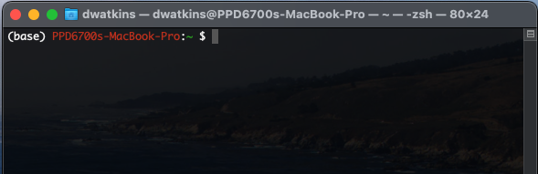

Using the Command Line and Terminal
===================================

The command line interface was the primary way to interact with computers from the 60s through the 80s. There was no graphical user interface (GUI) or using the mouse like we're used to today. Just the keyboard. It was during the late 80s and 90s with the introduction of Apple's Macintosh and Microsoft's Windows that the using the command line was replaced with using a GUI ([Wikipedia](https://en.wikipedia.org/wiki/Command-line_interface)). But the command line has never gone away. It is still used for many applications, like in code development and high performance compuing (HPC). 



To complete tasks on a command line or terminal, programs or commands have to be run. Many times, commands are connected to others to execute desired tasks. Certain programs and commands that execute on the command line are called shell scripts. The original Unix shell program was called ```sh``` ([Ubuntu](https://ubuntu.com/tutorials/command-line-for-beginners#2-a-brief-history-lesson)). Today, there are a number of shell programs such as sh, bash, zsh, csh, and ksh. Each of them have slightly different commands and syntax that is used when writing scripts. *Windows Powershell has its own commands. We'll focus on the Unix-type shells.*

(There are a lot of usual things you can do with shell scripts, but we'll focus on just some simple commands here. We'll let you explore what can be accomplished with shell scripts!)

Shells
======
I'll cover two shells that are similar: Bash, which stands for the "Bourne-again shell" and Zsh, "Z shell". These are how you interact with the command line.

Both were created around the same time. Bash was released in 1989 and Zsh was released in 1990 ([Stackabuse](https://stackabuse.com/zsh-vs-bash)). Bash is the default shell for GNU and most Linux distributions, while Zsh is the default shell for Mac OS X versions 10.3+ (previously Bash was) ([Stackabuse](https://stackabuse.com/zsh-vs-bash)). They have similar commands and both can be customized, although through different methods.

Both have their respective "startup" rc files, which are hidden files. For Bash, its file is `.bashrc` while Zsh's is `.zshrc`, and they are stored in the user's home directory. You use these files to add program paths, create aliases, and make customizations. When you make changes to these files, you either have to exit/restart your terminal, or use the `source` command (i.e `$ source .zshrc`).

Important Commands
==================
The first thing to note is using the terminal is pretty much entirely keyboard based. There are precious little you can use your mouse for. Now, We'll start with some basic navigation commands. Many of these are "aliases", which are nicknames for running commands or programs. These will work for shells like Bash and Zsh. 

`pwd` : print working directory  
`cd` : change directory  

When using `cd`, you have to follow it with the directory name you want to change into. Say you are in your home directory (the shortcut to get back to your home directory is simple `cd`), and you want to change into `Pictures/`. You would use `cd Pictures/`. Or maybe you have another directory inside `Pictures/` called `NewYears2019`. From your home directory you could do `cd Pictures/NewYears2019/` which would place you into the `NewYears2019/` directory. To go up one directory to `Pictures/`, you used the command `cd ..`.

`mkdir` : make directory  
`cat` : preview contents of file  
`ls` : lists contents in the directory  
`ls -a` : list all  

When a command is followed by a `-` and letters and/or numbers, these are referred to as an option, switch, or flag.

`rm` : remove  

There is no "trash" folder for deleted files. Once you `rm` files or directories, they are gone. To remove directories, you need to use a the option/flag `-r`. So, it would be `rm -r directory/`.

`*` : wildcard character   

The wildcard character can be used to execute a command on files or directories that have the name as what preceeds the `*`. You should be careful when using a wildcard. For example, ` rm *` will delete everything. This can be dangerous especially if combined with certain options/flags. 

`mv` : move  
`cp` : copy  
`which` : locates executate file for command  
`man` : manual  

The `man` followed by a command opens up that command's manual, which contains a description of the command, as well as options/flags that can be applied to it. Additionally, you often can find help by using `--help` after a command.

`sudo`: switch user/superuser and do

For some things, you need to have "root" access. "Root" is essentially the ultimate administrator account with power to do pretty much anything. But working in the root account is generally a bad idea for that reason. "With great power comes great responsibility." Instead, it's better to stay in your normal account and use the `sudo` when you need the root/admin powers.

`whoami` : displays current user