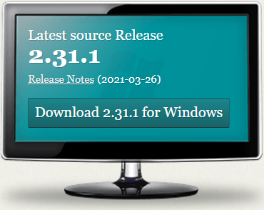

TurboPy Bootcamp Development Environment
===============================

The "default" ***turboPy Bootcamp Development Environment*** consists of:

- [miniconda](https://docs.conda.io/en/latest/miniconda.html)
- [git](https://git-scm.com/)
- [Microsoft Visual Studio Code (VS Code)](https://code.visualstudio.com/) with [extensions](https://marketplace.visualstudio.com/VSCode):
  - Anaconda Extension Pack, which includes
    - [Python support by Microsoft](https://marketplace.visualstudio.com/items?itemName=ms-python.python)
    - [YAML support by Red Hat](https://marketplace.visualstudio.com/items?itemName=redhat.vscode-yaml)
  - [Jupyter Notebook support by Microsoft](https://marketplace.visualstudio.com/items?itemName=ms-toolsai.jupyter)
  - [GitHub Pull Requests and Issues management by GitHub](https://marketplace.visualstudio.com/items?itemName=GitHub.vscode-pull-request-github)

**Note: the following walkthrough demonstrates how to setup the above development environment on Windows 10.*

## Miniconda

[Miniconda](https://docs.conda.io/en/latest/miniconda.html) is a free minimal installer for conda. 
It is a small, bootstrap version of Anaconda that includes only conda, Python, the packages they depend on, and a small number of other useful packages, including pip, zlib and a few others. 
Two of the primary uses of the `conda` command:
1. install Python packages from repositories like [conda-forge](https://conda-forge.org/) (*e.g.* `conda install pandas`)
2. manage python development environments (*.e.g.* `conda activate turbopy`)

### Installing Miniconda

From the main [Miniconda documentation page](https://docs.conda.io/en/latest/miniconda.html), download the latest Miniconda3 installer.


Run the installer, and accept the defaults:  
- install in `C:\Users\username\miniconda3`
- *do not* add Miniconda3 to PATH
- *do* register Miniconda3 as default Python 3.9


Once the installer completes, you will have an "Anaconda3" folder in your Windows Start Menu that contain `Anaconda Prompt` and `Anaconda Powershell Prompt` links.

### Verifying and updating your Miniconda installation

To verify your Miniconda installation, open an Anaconda Prompt and run the following commands:

- Python is in your PATH variable: `echo %PATH%`
- Miniconda3 is default Python: `where python`
- what conda environments are defined: `conda env list`
- which packages are installed in your current conda environment and their version numbers: `conda list`

To update conda, run the command `conda update conda` at the Anaconda Prompt.

We also want to be compliant with the Anaconda Terms of Service. (See [Anaconda Commercial Edition FAQ](https://www.anaconda.com/blog/anaconda-commercial-edition-faq) for some background if interested.) In addition to using Miniconda instead of the full Anaconda installation, we need to setup [conda-forge](https://conda-forge.org/) as our highest priority channel for Python package installation with `conda` and activate `strict` channel priority:

```
conda config --add channels conda-forge
conda config --set channel_priority strict
```

### conda environments

If you still have your Anaconda Prompt open, do you notice the `(base)` at the beginning of your Anaconda Prompt? That indicates that you are in your base conda environment. 

Conda allows you to create separate environments containing files, packages, and their dependencies that will not interact with other environments.

You **do not** want to install packages into your base environment. Create separate environments to keep your programs isolated from each other and manage dependencies when developing new code.

You will understand conda environments better once you complete the homework. You will be an expert on managing conda environments once you complete the turboPy Bootcamp!

## Visual Studio Code (Part 1)

We will be using [Visual Studio Code (VS Code)](https://code.visualstudio.com/) as our default integrated development environment (IDE).

### Installing VS Code

From the [VS Code homepage](https://code.visualstudio.com/), download and run the installer. (Just go with default options during the installation.)

### Configuring VS Code

VS Code configuration is controlled through "Settings" and "Extensions" (see File -> Preferences menu).

Install the following [extensions](https://marketplace.visualstudio.com/VSCode) from within VS Code:
- [Python support by Microsoft](https://marketplace.visualstudio.com/items?itemName=ms-python.python), which includes
 [Jupyter Notebook support by Microsoft](https://marketplace.visualstudio.com/items?itemName=ms-toolsai.jupyter)
- [YAML support by Red Hat](https://marketplace.visualstudio.com/items?itemName=redhat.vscode-yaml)
- [GitHub Pull Requests and Issues management by GitHub](https://marketplace.visualstudio.com/items?itemName=GitHub.vscode-pull-request-github)

But before the built-in git functionality in VS Code can work, we need to close out of the program and go install git itself. 

## git

From the [git homepage](https://git-scm.com/): *git is a free and open source distributed version control system designed to handle everything from small to very large projects with speed and efficiency.*

### Installing git

From the [git homepage](https://git-scm.com/), download and run the installer for git for Windows.



*Note: the git installer makes system-wide changes and requires admin privileges on your machine.*

The default components are fine:


Use VS Code as Git's default editor:


Use "main" as the default branch name for new repositories:


For the remainder of the installation, just go with defaults.

### Run `conda init bash` in Anaconda Prompt

Now that we have `git` installed, we have an app called "git Bash." Bash (see
[the manual](https://www.gnu.org/software/bash/manual/)) is an `sh`-compatible shell developed by GNU. It provides command-line editing, job control, shell functions and aliases, and many other useful tools for interacting with your computer at the most basic level--the command-line. Bash is configured through text files named `.bashrc` or `.bash_profile` or `.profile` or `.bash_login`.

We need to tell Git Bash about Miniconda, and more specifically, the command-line tool `conda`. To do this, we need to open an Anaconda Prompt and type the command `conda init bash`.


This adds the following to our `.bash_profile` file so that `conda` is initialized when we fire up the Git Bash prompt (command-line):

```
# >>> conda initialize >>>
# !! Contents within this block are managed by 'conda init' !!
eval "$('/C/Users/adamson/miniconda3/Scripts/conda.exe' 'shell.bash' 'hook')"
# <<< conda initialize <<<
```

### Creating and using an SSH key to fork and clone a Repository

Once you have git installed, you will need to generate an ssh key and add it to GitHub. Follow steps 1-4 of [Steps to generate a new ssh key on GitHub.](https://docs.github.com/en/github/authenticating-to-github/connecting-to-github-with-ssh/generating-a-new-ssh-key-and-adding-it-to-the-ssh-agent)(***Note that you will need to select your operating system (Mac, Windows, or Linux) at the top of the page!***)

You do not necessarily need to set up a passphrase, since this ssh key will only be available to be used from the machine you attach it to. If you choose not to have a passphrase then just press "Enter" instead of creating and confirming a passphrase.

You will then need to follow steps 1-2 of [Adding ssh key to the ssh agent.](https://docs.github.com/en/github/authenticating-to-github/connecting-to-github-with-ssh/generating-a-new-ssh-key-and-adding-it-to-the-ssh-agent#adding-your-ssh-key-to-the-ssh-agent) (Make sure you still have the correct operating system selected.)

A public-private ssh key pair will be created and saved in the folder you identified during the previous step (probably `~/.ssh`). The file name of the keys will be the same except one is public (ends in `.pub`) and one is private (no extension). You will add your PUBLIC ssh key to your Github account. DO NOT SHARE YOUR PRIVATE KEY!

#### Adding ssh key to Github

Open the `~/.ssh` folder, and within this folder should be your public-private ssh key pair.

(Note, if you have Microsoft Publisher installed, your public key will be identified as a Publisher file. Even if yours is not, confirm that the file has the .pub extension before continuing forward.)


Open the .pub file with your favorite text editor. To open it up in Notepad on Windows: app -> File -> Open -> ~/.ssh -> ”Public ssh key”.

*NOTE - once opened, your public key will look similar to the image below and will include the email address you entered in the first section, your PRIVATE key will be much longer and include "PRIVATE KEY" at the top of the text. DO NOT paste your private key into Github!*


Once you have accessed your public key, copy the entire text to your clipboard.

Enter your Github profile -> drop down menu by avatar -> settings -> SSH and GPG keys.


Your page should look like this except you will not have anything under SSH keys. Click the green button, “New SSH key.” 


Create a title for your key. (I recommend something based off the machine you’re using because you may create additional keys for different computers “personal, work, etc...”)

Paste the entire text of the Public key under "key."

Click the green button "add SSH key."

Go to the main page of the repository you want to fork-clone.

Using the button in the top right fork the repository over to your personal page.


Once forked to your personal page, enter into this new repository. 

From the forked repository (should be titled "your profile name"/"name of repository") locate the green button labeled "Code". Click on the drop-down menu, you will be offered 3 options, click on SSH. Then copy the link to your clipboard.


Within Git Bash follow the above lines of code to create a folder for the cloned repository.


Enter the following line of code:

$ 'git clone' 

Follow this by pasting the SSH URL to the same line of code. Then press enter.

#### COMMMON ERROR:

Make sure that there is no empty file with the same name as the repository you are attempting to clone. This could occur if you previously failed when cloning the repository. Simply delete the empty file and then attempt the cloning again.

### Clone turbopy-bootcamp

Let's clone this repo, turbopy-bootcamp.

Run the `Git Bash` command that was just installed. You should get the following window:


This is a Bash shell just like you would get by default when you login on many unix-like operating systems. By default, you will be in your home directory (for me on my system, C:\Users\adamson). The `pwd` or "print working directory" command will show you where you're at:


*Note: `/c/Users/adamson` in bash is equivalent to `C:\Users\adamson` in Windows.*

Let's make a home for our projects this summer. The `mkdir` or "make directory" command will make a directory (or folder). `cd` or "change directory" moves us into a directory. I like to use a directory called "projects" all in lowercase:


Now, let's copy the repo from github to our local machine so that we can edit it. To do that, we use the `git clone` command and pass it the appropriate url for cloning the repository. 

But first, a **very** important thing to remember: we **almost never** push directly to an 
organizational repo. 
***We push to a copy of the repo (a "fork") in our personal GitHub account, then submit a pull request (PR).*** 
The PR is the process of asking the organizational repo maintainers to merge changes we made in the copy (fork)
in our personal account into the official repository.

So let's fork turbopy-bootcamp. Go to [the project's page on GitHub](https://github.com/NRL-Plasma-Physics-Division/turbopy-bootcamp), and click the "Fork" button in the top right corner of the page. 

Now, you should have a copy of the repo in your personal GitHub account.
To get the cloning url, go to the page for your fork, click the green "Code" button, and copy the clone url to the clipboard. The url should be something like: https://github.com/your_GitHub_username/turbopy-bootcamp.git.

*Note: the cloning URL should not have NRL-Plasma-Physics-Division in it. If it does, then you have copied the cloning URL from the organizational page and not your personal account!*


Back to Git Bash, and we can issue that `git clone` command and download a copy of the repo to our local machine. (If you are authenticating with ssh, you may need to select the ssh URL, not https, for the clone url.)


*Note: since turbopy-bootcamp is a private repo, git will ask you to authenticate with GitHub.*

Now, if you look in your `~/projects` folder, you have a cloned copy of the repo. You can do this by executing the `ls` command in Git Bash or navigating to the folder in Windows Explorer.

Note that there are many ways to interact with `git` and GitHub:
- [GitHub website](https://github.com)
- Command line (which we just did)
- VS Code Extension (which we will finish setting up below)
- Various GUIs, including [GitHub Desktop](https://desktop.github.com/)

I encourage you to explore them all in [G3 - Git and GitHub](https://github.com/NRL-Plasma-Physics-Division/turbopy-bootcamp/tree/main/G3).

## VS Code (Part 2)

Now that git is installed and we have a copy of our fork of turbopy-bootcamp, we can go back to VS Code to finish and verify the configuration.

Within VS Code, go to "File -> Open Folder..." and open the turbopy-bootcamp repo that you just cloned. In the bottom left-hand corner, you should see the git branch icon with "main" next to it to indicate that you currently have the "main" branch of the repo "checked out."


Also within VS Code, select the GitHub icon in the Activity Bar on the left side of the app. You should get a message that you have not yet signed in with GitHub. Click the "Sign In" button and authorize GitHub to communicate with VS Code. Once you do, you will have access to pull requests and issues for the repository from within VS Code.


### Make Git Bash our default external terminal

In VS Code, open the settings dialogue (click the cog icon at bottom left -> click settings), and search for "terminal". Find the setting "Terminal: Explorer Kind" and set to "external."


Now, in the settings, search for "terminal integrated windows," and set "Terminal > Integrated > Default Profile: Windows" to "Git Bash."

