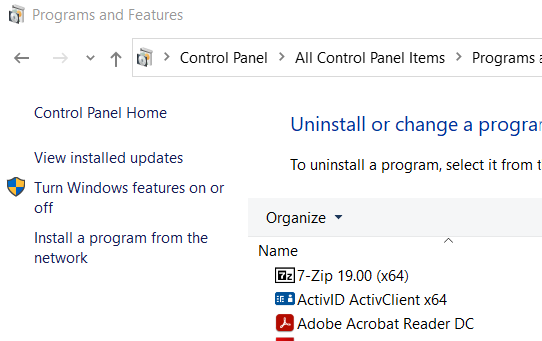
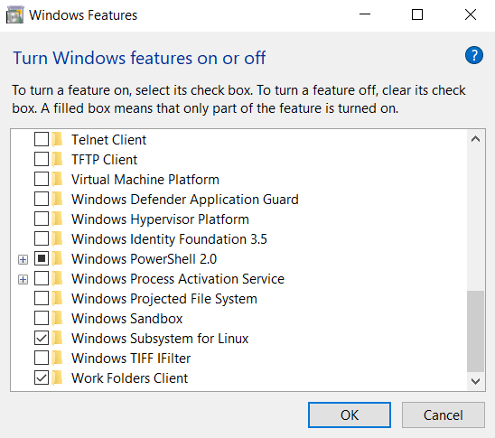
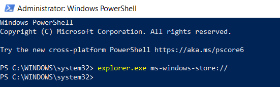
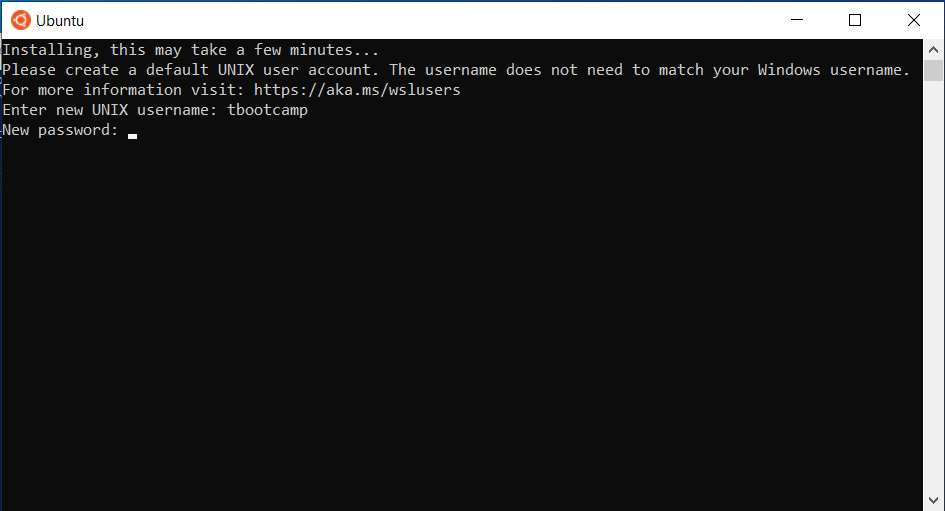
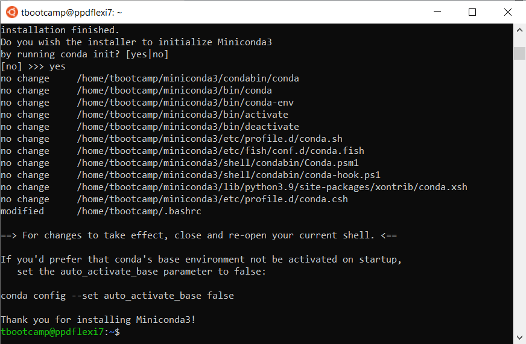

# WSL Intructions
The purpose of this document is walk through installing Windows Subsystem for Linux (WSL) 
on your Windows machine.

# Windows Subsystem for Linux
WSL is a Linux environment that allows you to run most Linux "command-line tools, utilities, 
and applications directly on Windows." This removes some of the frustration that comes with 
trying to develop code natively on Windows. Currently, there are a number of Linux distributions
that can be added to Windows/WSL. But, for our purposes, we will use the popular Ubuntu
distribution. Note: while this functions as a virtual machine, WSL provides only a terminal
view. So, you'll need to get familiar using terminal commands.

# Installation
You first need to make sure that WSL is activated for your Windows computer. You can enable this
by going to ```Control Panel>Programs and Features>Turn Windows Features on or off```.



Or you directly search for Windows Features via the taskbar search. You must enable this, 
if unchecked. It will require you to restart your computer.



Go to the ```Microsoft Store```, and search for ```Ubuntu```. You can then install it. 
Note: You will need to sign into a Microsoft account or create one from your email. In the past, 
you could skip signing in, but it appears this is no longer an option. Additionally, it's best 
to have your Windows OS updated.


If Ubuntu fails to install (just sits there, fails, etc), it's possible that you need to open
Microsoft Store as an administrator.
To do this, search Powershell. Right-click, and select "Run as administrator". 


Execute the command
```
explorer.exe ms-windows-store://
```



Then go to "Ubuntu" again and install.

# Ubuntu Initialization
When Ubuntu first launches, it will ask you to create a username. It can whatever you'd like (all lowercase, no spaces). A typical username can be the first letter of your name followed by your lastname. Hit ```enter``` once you are done typing.


Next, you will be required to create a password. Note: Linux does not show any indication that you are typing when entering a password, so just be aware.



Congrats! You have Ubuntu up and running! At this point, you should take some time to learn how to use a terminal window. 


After you're finished, exit Ubuntu either using the command
```
$ exit
```
or exiting the application like other Windows programs.

# VS Code and WSL
If you haven't installed VS Code, you should do this now. Refer back to the G2 Development Environments seminar and notes.

After VS Code is installed, we can link it to our Ubuntu. If it is a fresh install, it may prompt you to install the Remote - WSL extension. You can do this or search for the "Remote Development" extension back in VS Code and install this.


Now, open Ubuntu. The command
```
$ code .
```
will open VS Code to start in the current directory (The ```.``` tells VS Code to use the current
directory). It will install the VS Code Server, and then open VS Code. From there, you can make 
all the coding changes, run terminal commands, etc, from within VS Code.

# Add Miniconda to Ubuntu
You'll need to install Miniconda to Ubuntu, which happens differently than simply downloading an installation executable. 

Go to the [Miniconda Installers site](https://docs.conda.io/en/latest/miniconda.html#linux-installers).
Scroll down until you get to Linux Installers. Right click on the "Miniconda3 Linux 64-bit" for Python 3.9, and copy the link address.


In your Ubuntu terminal, use the command ```$ wget ``` and paste the link you just copied (you can right link in the terminal window and it will automatically paste what is in your clipboard.
Hit "Enter" to run the command and watch the magic unfold.


Once it has finished downloading, use the command ```$ bash ``` and type out the name of the file that was just saved. You can start typing "Mini..." and hit "Tab" to autocomplete the filename. Hit enter to run this. 

It will ask you if you want to continue, hit "Enter", and then continue to hit enter to make your way through the licensing readme. At the end, type "yes" to accept. Then let it install in the default location.


Once this is done, it will ask you if you want to initialize Miniconda3. Enter "yes".
Restart the terminal by closing and opening a new instance. Congrats! You now have 
your base conda environment created. 



You can check your Python version by
```
$ python --version
```
The version you selected from the Miniconda site should be displayed. 


# Additional Notes: WSL 1 vs WSL2
There is technically two editions of WSL. Microsoft recommends using WSL 2, but that requires a
few extra steps to install, mainly on using the Powershell. I don't really know if for what we're
doing this summer, there is a benefit or drawback to using one over the other.

If you'd like to check out the differences, see this [link](https://docs.microsoft.com/en-us/windows/wsl/compare-versions).
If you want to upgrade WSL 1 to WSL 2, here is a [walk-through](https://docs.microsoft.com/en-us/windows/wsl/install-win10).
